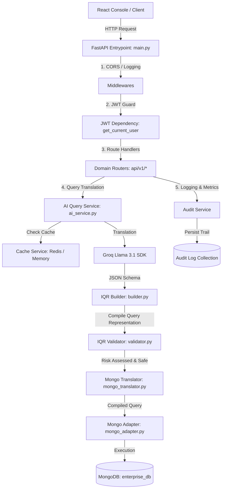

# System Architecture — LLM Real-Time Database Query Engine

This document describes the high-level system architecture, the request-response pipelines, and security layers.

## 1. High-Level Architecture Diagram

---

## 2. Request Translation Pipeline Stages

Whenever a user inputs a natural language query (e.g., *"Show successful UPI transactions above ₹1000"*):

1. **Authentication Guard**:
   * The client sends a JWT bearer token in the `Authorization` header.
   * `get_current_user` extracts the JWT, verifies the signature, and returns the tenant identity (`org_id`) and role access level (`role`).
2. **Query Caching**:
   * The AI Service hashes the normalized prompt text: `org_<org_id>:query_<sha256_hash>`.
   * Checks the Redis Cache first. If found, returns the cached query representation directly, bypassing LLM call.
3. **LLM Translation Generation**:
   * System prompt template is loaded from `mongo_query_prompt.txt`.
   * Real-time context (UTC current timestamp) is injected.
   * Calls Llama 3.1 via Groq. Deterministic output is parsed (fences extracted if required) and verified.
4. **Intelligent Query Representation (IQR) Compiler**:
   * Raw JSON is parsed into a structured `QueryRepresentation` containing generic conditions (field, operator, value), sort paths, and project structures.
5. **Static Query Validation & Risk Assessment**:
   * Custom validator recursively inspects query nodes for blocked operators (`$where`, `$expr`, etc.), restricted pipeline stages, and invalid schema fields.
   * Classifies the operation risk level based on scope (find is low, specific update is medium, delete is high).
6. **Execution Adapter**:
   * Concrete `MongoAdapter` performs safe read-only or authorized write commands against the database.
   * Converts `ObjectId` records to strings automatically.
7. **Audit & Telemetry Logging**:
   * `AuditService` records the user ID, execution latency, translated query, and transaction status to the database.
