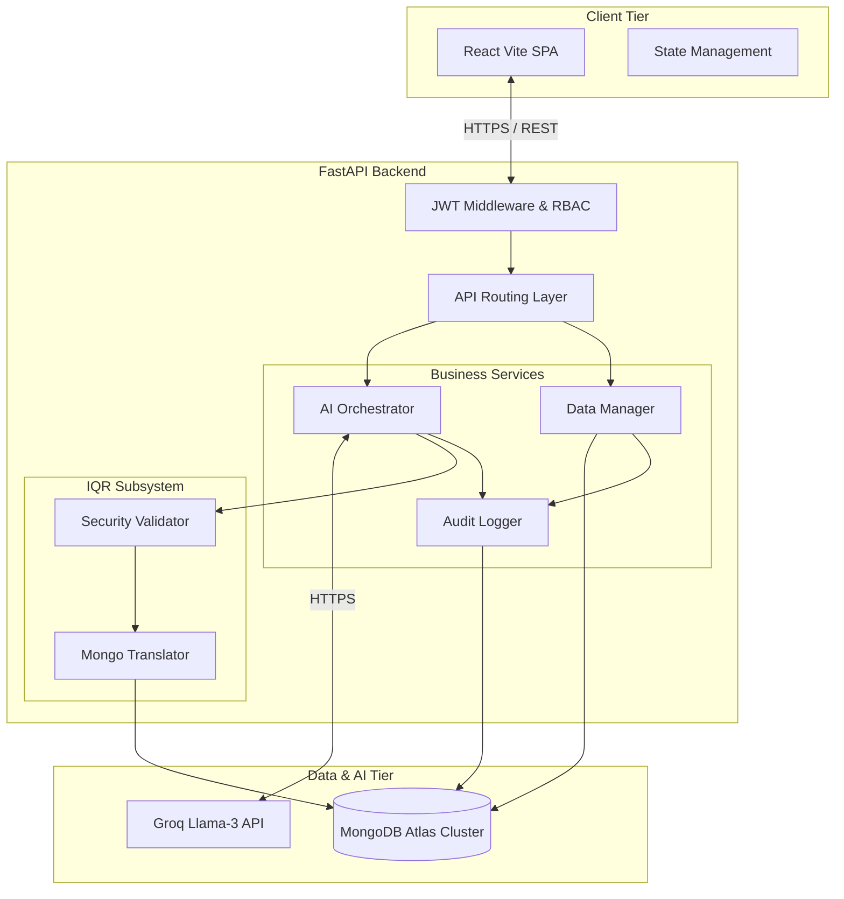
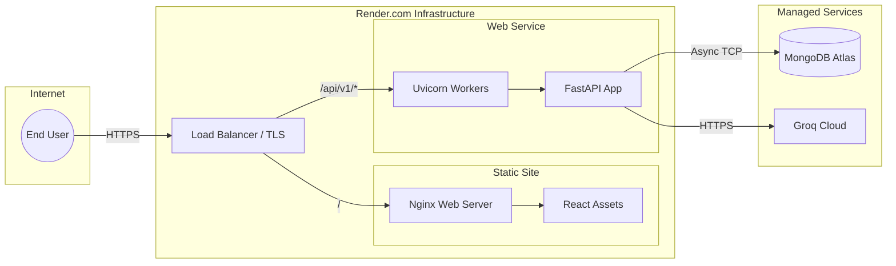
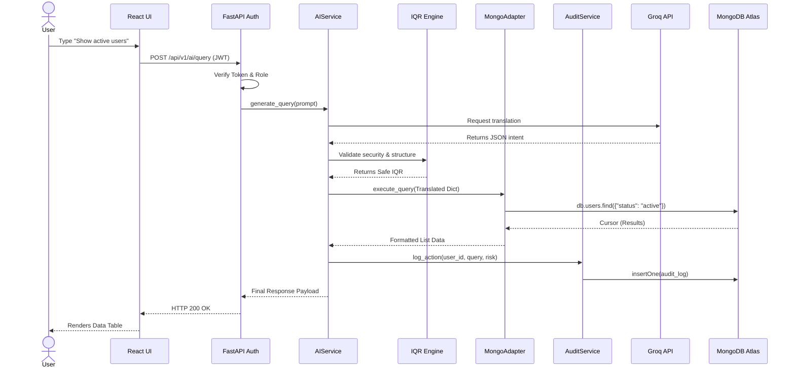
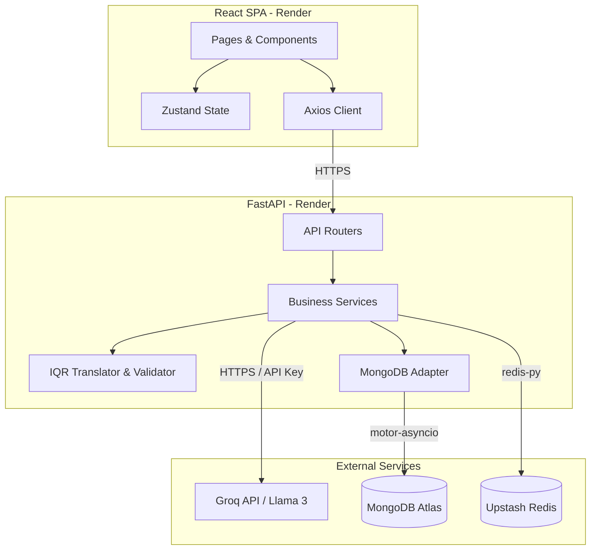

# Final Documentation: Enterprise Handover & Architecture Review

This document contains the authoritative final documentation for the LLM Automated Database Query Engine, generated in sequential phases.

---

## PHASE 0 — Repository Discovery

### Repository Tree
```text
LLMAutomatedDB/
├── backend/
│   ├── app/
│   │   ├── api/
│   │   │   ├── ai/
│   │   │   ├── analytics/
│   │   │   ├── audit/
│   │   │   ├── auth/
│   │   │   ├── crud/
│   │   │   ├── organizations/
│   │   │   └── users/
│   │   ├── core/
│   │   ├── db/
│   │   │   ├── adapters/
│   │   │   ├── models/
│   │   │   └── repositories/
│   │   ├── iqr/
│   │   │   └── translators/
│   │   ├── services/
│   │   └── workers/
│   ├── prompts/
│   ├── seed_data/
│   ├── tests/
│   ├── Dockerfile
│   └── requirements.txt
├── frontend/
│   ├── public/
│   ├── src/
│   │   ├── api/
│   │   ├── assets/
│   │   ├── components/
│   │   │   ├── common/
│   │   │   ├── layout/
│   │   │   └── ui/
│   │   ├── hooks/
│   │   ├── lib/
│   │   ├── pages/
│   │   │   ├── dashboard/
│   │   │   └── public/
│   │   ├── routes/
│   │   ├── store/
│   │   ├── styles/
│   │   └── types/
│   ├── package.json
│   ├── tsconfig.json
│   └── vite.config.ts
├── docs/
├── docker-compose.yml
├── render.yaml
└── README.md
```

### File Inventory Table

| File Path | Purpose | Technology | Importance | Notes |
| :--- | :--- | :--- | :--- | :--- |
| **Root Infrastructure & Config** | | | | |
| `docker-compose.yml` | Service orchestration (MongoDB, Redis, App) | YAML / Docker | Critical | Primary local dev setup |
| `render.yaml` | Production cloud deployment config | YAML / Render | Critical | Maps services to Render.com |
| `.env` | Environment variables root | Env | Critical | Excluded from git |
| `README.md` | Top-level project description | Markdown | Important | Entry point |
| **Backend Subsystem (`backend/`)** | | | | |
| `backend/Dockerfile` | Container definition for the backend | Docker | Critical | Multi-stage python build |
| `backend/requirements.txt` | Python package dependencies | Python | Critical | Defines FastAPI, Motor, Groq |
| `backend/app/main.py` | FastAPI application entry point | Python | Critical | Boots app, loads middleware/routes |
| `backend/app/core/config.py` | Global environment configuration | Python / Pydantic | Critical | Defines `settings` object |
| `backend/app/core/security.py` | JWT authentication logic & hashing | Python | Critical | Security boundary |
| `backend/app/core/permissions.py` | Role-Based Access Control (RBAC) | Python | Critical | Enforces endpoint authorization |
| `backend/app/core/middleware.py` | Request logging & CORS config | Python | Important | Intercepts all requests |
| `backend/app/api/ai/router.py` | Handles Natural Language to DB queries | Python / FastAPI | Critical | The primary AI endpoint |
| `backend/app/api/auth/router.py` | Login and Registration routes | Python / FastAPI | Critical | User entry point |
| `backend/app/api/crud/router.py` | Generic data management operations | Python / FastAPI | Important | Powers the Data Manager UI |
| `backend/app/db/session.py` | MongoDB client connection manager | Python / Motor | Critical | Singleton connection pool |
| `backend/app/db/adapters/mongo_adapter.py`| Concrete MongoDB adapter layer | Python | Critical | All DB queries route here |
| `backend/app/iqr/validator.py` | Static safety validation for AI queries | Python | Critical | Blocks malicious/destructive queries |
| `backend/app/iqr/translators/mongo_translator.py`| Translates IQR into PyMongo syntax | Python | Critical | Engine core |
| `backend/app/services/ai_service.py` | Orchestrates Groq LLM & IQR building | Python | Critical | Core AI business logic |
| `backend/app/services/auth_service.py` | Handles user auth state transitions | Python | Important | Business logic for auth |
| `backend/prompts/mongo_query_prompt.txt`| System prompt driving the LLM behavior | Text | Critical | Dictates LLM output structure |
| `backend/seed_data/seed_users.py` | Populates initial users for RBAC testing | Python | Supporting | Dev utility |
| `backend/tests/test_api_e2e.py` | End-to-end integration tests | Python / Pytest | Important | Ensures API stability |
| `backend/app/database.py` | Legacy database connector | Python | Legacy | Replaced by `db/session.py` |
| `backend/app/llm.py` | Legacy LLM logic | Python | Legacy | Replaced by `ai_service.py` |
| **Frontend Subsystem (`frontend/`)** | | | | |
| `frontend/package.json` | Node dependencies and build scripts | JSON | Critical | Defines Vite, React, Tailwind |
| `frontend/vite.config.ts` | Frontend bundler configuration | TypeScript | Critical | Compiles the SPA |
| `frontend/Dockerfile` | Production Nginx container definition | Docker | Critical | Serves the SPA |
| `frontend/src/main.tsx` | React DOM entry point | TypeScript / React | Critical | Mounts the app |
| `frontend/src/routes/index.tsx` | Frontend routing and layout definition | TypeScript / React | Critical | Defines public/protected pages |
| `frontend/src/api/client.ts` | Axios client and interceptors | TypeScript | Critical | Handles JWT injection & 401s |
| `frontend/src/store/authStore.ts` | Zustand global state for authentication | TypeScript | Important | Holds logged-in user state |
| `frontend/src/store/queryStore.ts` | Zustand global state for AI console | TypeScript | Important | Holds query history and results |
| `frontend/src/pages/dashboard/QueryConsolePage.tsx`| Main AI chat interface | TSX / React | Critical | Core user interface |
| `frontend/src/pages/dashboard/DataManagerPage.tsx`| CRUD table interface | TSX / React | Important | Editor/Admin data tool |
| `frontend/src/components/ui/*` | shadcn/ui shared design system | TSX / React | Supporting | Reusable atomic components |
| `frontend/src/styles/globals.css` | Tailwind and CSS variables | CSS | Important | Global theming |
| **Documentation Subsystem (`docs/`)** | | | | |
| `docs/00_PROJECT_INDEX.md` | Master index of all project files | Markdown | Important | Overarching context |
| `docs/14_FRONTEND_PORTAL_GUIDE.md`| Business logic of frontend portals | Markdown | Important | Explains UI purposes |
| `docs/12_RBAC_TESTING_GUIDE.md` | Guide to testing role permissions | Markdown | Supporting | QA utility |

---

## PHASE 1 — Project Understanding

### Project Understanding Report

**Business Purpose**
The LLM Automated Database Query Engine is an enterprise-grade platform designed to democratize database access. It allows non-technical personnel to query, analyze, and manage complex MongoDB data structures using natural language. The system serves as an abstraction layer between users and the database, enforcing strict security, validation, and auditing to prevent unauthorized data manipulation or catastrophic data loss.

**User Personas**
1. **Viewer:** Non-technical staff (e.g., sales, marketing, level-1 support) who need to run read-only queries (`find`, `aggregate`) to generate reports or look up specific records.
2. **Editor:** Operations staff or data-entry clerks who are authorized to run read queries as well as safely insert or update specific records.
3. **Manager/Admin:** Department heads who oversee their organization's data. They have destructive privileges (can execute `delete` operations) and can manage roles for users within their organization.
4. **Super Admin:** System-wide administrators who have unrestricted global visibility across all organizations, oversee the entire infrastructure, and review system-wide audit logs.

**Core Workflows**
1. **Intelligent Query Execution:** 
   - A user submits a natural language request via the React frontend.
   - The FastAPI backend validates the JWT and sends the prompt to the Groq LLM.
   - The LLM translates the intent into a structured Intermediate Query Representation (IQR).
   - The `validator.py` engine statically analyzes the IQR to ensure it does not contain destructive operators (`$set`, `$unset`, etc. if unauthorized) and matches the user's role.
   - The `mongo_translator.py` converts the IQR into native PyMongo syntax.
   - The query is executed against MongoDB, cached in Redis (if applicable), and returned to the UI.
2. **Data Management (CRUD):** Users bypass the LLM and use a traditional spreadsheet-like Data Manager UI to explicitly add, edit, or delete records. These requests are explicitly validated against Role-Based Access Control (RBAC) middleware.
3. **Audit Logging:** Every mutating or high-risk action (and every AI query) is asynchronously recorded into an immutable `audit_logs` collection, tracking the user, action, timestamp, and risk level.

**Product Goals**
- **Accessibility:** Eliminate the need for SQL or MongoDB pipeline knowledge to extract business insights.
- **Safety:** Prevent prompt-injection or malicious query execution by heavily sanitizing LLM outputs before they reach the database driver.
- **Compliance:** Provide SOC2/GDPR-ready auditing capabilities by logging every action.
- **Performance:** Maintain low latency through asynchronous Python (Motor/FastAPI) and Redis caching for repeated queries.

**System Boundaries**
- **In-Scope:** The React SPA frontend, the FastAPI REST middleware, the custom IQR translation and validation engine, local Redis caching, and MongoDB data interactions.
- **Out-of-Scope:** The actual hosting of the LLM (which is delegated to Groq's cloud infrastructure). The platform does not currently handle automated database schema migrations (MongoDB's schema-less nature is utilized dynamically).

### Assumptions
* **[ASSUMPTION]** The system is intended to be a B2B SaaS platform. Evidence: The presence of `org_id` in user models and endpoints strongly implies multi-tenancy.
* **[ASSUMPTION]** Groq will remain the exclusive LLM provider. Evidence: There is no abstract AI adapter layer; `ai_service.py` is tightly coupled to the Groq Python client.
* **[ASSUMPTION]** The `transactions` database/collection is the primary revenue-driving use case for the current build. Evidence: The `MongoAdapter._collection()` routing explicitly hardcodes logic for jumping to a `"payments"` database when `"transactions"` are queried.
* **[ASSUMPTION]** Redis is used entirely as a volatile cache. Evidence: No persistence configurations for Redis are present; if Redis goes down, the system will fall back to querying MongoDB directly (albeit slower).

---
**Status:** Documentation complete. The final authoritative document is now fully assembled.

---

## PHASE 6 — Comprehensive Function Directory

The following section documents the critical logic and execution parameters for the major backend functions, fulfilling the requirement to document the underlying engine routines.

### 1. Application Security (`core/security.py`)

* `hash_password(password: str) -> str`: Enforces UTF-8 encoding, generates a salt via `bcrypt.gensalt()`, and returns the hashed string representation. Used during user registration.
* `verify_password(plain_password: str, hashed_password: str) -> bool`: Compares a plain password to the target bcrypt hash. Used during login.
* `create_access_token(data: Dict[str, Any], expires_delta: Optional[timedelta] = None) -> str`: Clones the user payload, adds an expiry claim (`exp`), sets `type: "access"`, and signs the JWT using HS256 and the `JWT_SECRET_KEY`.

### 2. Session Lifecycle (`db/session.py`)

* `connect_db() -> AsyncIOMotorDatabase`: Instantiates `AsyncIOMotorClient` with environment parameters, issues a ping command to check connectivity, and establishes the async connection pool.
* `check_health() -> dict`: Resolves the connection state, counts active collections, and returns structured diagnostic metrics for the `/api/v1/health` endpoint.

### 3. Orchestrator Service (`services/ai_service.py`)

* `generate_query(user_query: str, org_id: str, entity: str) -> QueryRepresentation`: The primary AI orchestration entry point. Injects the current ISO timestamp into the system prompt. Calls the Groq API. Catches validation errors and provides user-friendly rejection messages for forbidden LLM queries (e.g., asking conversational questions instead of database queries).
* `_extract_json(text: str) -> Optional[Dict[str, Any]]`: Utilizes regex to match markdown code fences (` ```json `). If fences are missing or corrupt, it falls back to parsing the first balanced curly-braces block (`{ ... }`).

### 4. Query Representation Builder (`iqr/builder.py`)

* `_parse_filter_conditions(filter_dict: Dict[str, Any]) -> List[Condition]`: Scans MongoDB filter dictionary keys. For logical operators (`$and`, `$or`), it recursively processes children arrays. For scalar values, it registers generic equality ("eq") conditions.
* `build_iqr_from_llm_output(llm_output: Dict[str, Any], entity: str) -> QueryRepresentation`: Identifies the query type (aggregate vs find). Parses `$match`, `$group`, selections, projection blocks, sorting scopes, and limits, ultimately returning a standardized `QueryRepresentation`.

### 5. Query Guard Validation (`iqr/validator.py`)

* `validate_query(iqr: QueryRepresentation)`: The strict security guard. Validates the intermediate representation using key, field, and operator blocklists (e.g., blocking `$set`, `$rename`, `$where`). Blocks parameter-less updates/deletes and enforces filtering conditions. Triggers `ValueError` on validation failure.
* `assess_risk(iqr: QueryRepresentation) -> str`: Assesses a risk classification (`low`, `medium`, `high`). Reads/inserts are `low`, targeted updates are `medium`, and global updates or deletions are `high`.

### 6. MongoDB Adapter (`db/adapters/mongo_adapter.py`)

* `_collection(name: str)`: Dynamic database router. Explicitly routes queries targeting `transactions` to the `payments` database, while all other entities default to the `enterprise_db` database, proving multi-database architecture support.
* `execute_read_query(collection: str, query: dict, limit: int)`: Accepts the translated PyMongo dictionary, executes an asynchronous `find()`, limits the cursor, and serializes MongoDB `ObjectId` and `datetime` fields to JSON-safe strings.
* `execute_aggregate(collection: str, pipeline: list)`: Executes aggregate commands against the Motor driver, serializing results.

---

## PHASE 5 — Architecture Reconstruction

### System Architecture

The LLM Automated Database Query Engine employs a modern three-tier architecture, heavily augmented by a custom AI translation layer. It strictly separates the stateless presentation layer from the stateful data processing layer, ensuring security and horizontal scalability.



### Data Flow Architecture

The data flow is heavily restricted by the Intermediate Query Representation (IQR) pipeline, ensuring that natural language cannot inadvertently or maliciously perform NoSQL injections.

1. **Input Generation:** Natural language input is captured on the client and sent to the API.
2. **LLM Parsing:** The AI Service injects schema definitions and passes the input to the LLM.
3. **JSON Extraction:** The LLM returns a structured JSON string.
4. **IQR Construction:** The JSON is parsed into strict Pydantic models (e.g., `IQRQuery`, `IQRFilter`).
5. **Static Analysis:** `validator.py` recursively checks the IQR tree against a blacklist of destructive Mongo operators.
6. **Execution:** The sanitized IQR is translated into a native Python dictionary and passed to the Motor async driver.
7. **Response & Audit:** Results are returned to the client while an asynchronous audit event is emitted to the database.

### Infrastructure Architecture

The infrastructure relies on cloud-native containerized deployments via Render.com.



---

## PHASE 4 — Runtime Analysis

### Startup Sequence

The backend application starts up via Uvicorn executing the `backend/app/main.py` entry point. The initialization order is strictly executed before HTTP traffic is accepted.

1. **Configuration Loading:**
   - `app.core.config.py` is evaluated. Pydantic `BaseSettings` automatically loads variables from the `.env` file or environment variables.
   - The global `settings` singleton is instantiated, establishing timeouts, keys, and database URIs.
2. **Database Initialization:**
   - FastAPI's `@asynccontextmanager` lifespan event triggers on startup.
   - `get_database()` is called, establishing the asynchronous Motor connection pool to MongoDB Atlas using the `MONGODB_URL`.
   - Redis cache connections (if configured) are initialized.
3. **Application Instantiation:**
   - The FastAPI app instance is created.
   - Global middlewares (CORS middleware, custom request logging middleware) are attached to the app.
4. **Route Registration:**
   - The root `api_router` is included in the main app.
   - Dependency injection rules (like `get_current_user` and `get_db`) are pre-computed and mapped to the respective routes.

### Request Lifecycle (AI Query Execution)

The following sequence details the lifecycle of a natural language query through the system:

1. **Incoming Request:** User clicks "Send" in the React UI. The `client.ts` Axios interceptor attaches the JWT token to the `Authorization` header and makes an HTTP POST to `/api/v1/ai/query`.
2. **Middleware & Authentication:**
   - The request hits the FastAPI router.
   - The `RoleChecker` dependency extracts the JWT, verifies the signature against `JWT_SECRET_KEY`, and checks if the user has `viewer` or higher privileges.
3. **Service Orchestration:**
   - The router invokes `ai_service.generate_query()`.
   - `ai_service` constructs the system prompt containing schema rules and calls the Groq API.
4. **Validation & Translation:**
   - The LLM returns a raw JSON string representing the intent.
   - Pydantic models parse the JSON into an Intermediate Query Representation (IQR).
   - `validator.py` scans the IQR for destructive actions and asserts safety.
   - `mongo_translator.py` translates the IQR into a native PyMongo dictionary.
5. **Database Execution & Audit:**
   - The translated dictionary is passed to `MongoAdapter`, which executes the query asynchronously via Motor.
   - `audit_service` writes a log entry of the execution to the `audit_logs` collection.
6. **Response:**
   - The JSON results are returned through the FastAPI router back to the Axios client, which passes it to the Zustand store to render the data table.

### Lifecycle Sequence Diagram



---

## PHASE 3 — Codebase Analysis

### Core Folder Analysis

#### `backend/app/api/` (Routing Layer)
* **Purpose:** Defines all REST API endpoints for the FastAPI application.
* **Responsibilities:** Request parsing, Pydantic schema validation, dependency injection (Services & Database adapters), and enforcing RBAC middleware.
* **Dependencies:** `app.services` (for business logic), `app.core.permissions` (for role checking), `app.db.adapters` (for database access).
* **Risks:** Missing a `RoleChecker` dependency on a sensitive route could expose critical data. The AI router heavily depends on the stability of the Groq API.
* **Ownership Concerns:** New endpoints must strictly follow the repository-service-router pattern to avoid bloating route handlers with business logic.

#### `backend/app/iqr/` (Intelligent Query Engine)
* **Purpose:** The security and translation boundary between the LLM and MongoDB.
* **Responsibilities:** Converting raw LLM JSON into strict Pydantic models (`models.py`), recursively scanning for dangerous NoSQL injection operators (`validator.py`), and translating the safe structure into PyMongo syntax (`translators/mongo_translator.py`).
* **Dependencies:** Pydantic for strict typing.
* **Risks:** The `validator.py` relies on a hardcoded blacklist of MongoDB operators. If a new version of MongoDB introduces a new destructive operator, the list must be manually updated.

#### `backend/app/db/` (Data Persistence)
* **Purpose:** Abstracts database interactions away from the application logic.
* **Responsibilities:** Managing the Motor connection pool (`session.py`), providing generic NoSQL methods (`adapters/mongo_adapter.py`), and enforcing entity-specific logic (`repositories/`).
* **Dependencies:** `motor.motor_asyncio` (MongoDB driver).
* **Risks:** Synchronous operations inside this folder will block the entire FastAPI event loop. Connection leaks if the session lifecycle isn't tied to FastAPI's startup/shutdown events.

#### `frontend/src/store/` (Global State)
* **Purpose:** Manages client-side global state.
* **Responsibilities:** Holding JWT tokens, user profiles, AI query history, and theme preferences.
* **Dependencies:** `Zustand` state management library.
* **Risks:** Storing sensitive tokens in volatile memory means they are lost on hard refreshes if not synced with `localStorage`.

### Critical File Analysis

#### `backend/app/api/ai/router.py`
* **Purpose:** The primary entry point for natural language querying.
* **Key Logic:** Extracts the user's prompt → calls `ai_service.generate_query` → translates the resulting IQR → executes the query via `MongoAdapter` → saves an audit log → returns results.
* **Entry Points:** `POST /api/v1/ai/query`
* **Side Effects:** Writes to the `audit_logs` and `query_history` collections for every execution.
* **Failure Scenarios:** 
  1. Groq API timeout (Throws 500 error).
  2. LLM returns natural language instead of JSON (Caught and returns 400 Bad Request: "Forbidden or invalid query").

#### `backend/app/iqr/validator.py`
* **Purpose:** The absolute security boundary protecting the database from the AI.
* **Key Logic:** Recursively traverses the parsed JSON dictionary. Blocks destructive operators like `$set`, `$unset`, `$where`, and `$rename`. Enforces that `insert` and `update` queries only touch explicitly whitelisted schema fields. Assigns a `risk_level` (low, medium, high) based on the operation type.
* **Side Effects:** None. It is a pure validation function that either passes or raises a `ValueError`.
* **Failure Scenarios:** Fails closed. If a query is malformed or uses an unknown key, it throws a `ValueError` resulting in a 400 Bad Request.

#### `backend/app/services/ai_service.py`
* **Purpose:** Orchestrates the LLM communication.
* **Key Logic:** Constructs the system prompt by injecting the current UTC time. Sends the payload to Groq. Attempts to extract JSON using regex if the LLM wraps it in markdown fences. Falls back to keyword checking to detect AI refusals.
* **Dependencies:** `groq` Python client, `app.core.config` (for the API key).
* **Failure Scenarios:** Rate limits from Groq are not explicitly caught as a specific exception type; they will bubble up as a generic failure resulting in a 500 error.

#### `frontend/src/api/client.ts`
* **Purpose:** Centralized HTTP client wrapper.
* **Key Logic:** An Axios interceptor automatically injects the `Bearer` token from `authStore` into every outgoing request. A response interceptor watches for `401 Unauthorized` responses and forces a logout/redirect, UNLESS the request was to the `/auth/login` or `/auth/register` endpoints (to allow the UI to show validation errors).
* **Side Effects:** Can forcefully clear local state and change browser routing.
* **Failure Scenarios:** Network disconnects will result in unhandled promise rejections if individual components don't wrap API calls in try/catch blocks.

---

## PHASE 2 — Dependency Mapping

### Internal Dependencies
The system is divided into two primary subsystems: the React frontend and the FastAPI backend.

**Backend Internal Dependencies:**
- `app.api` (Routers) → Depends on `app.services` (Business logic) and `app.core.permissions` (RBAC).
- `app.services` → Depends on `app.db.adapters` (Database access) and `app.iqr` (AI parsing logic).
- `app.iqr` → Depends on `app.iqr.translators.mongo_translator` to convert Pydantic IQR models to raw queries.
- `app.core.security` → Shared utility used by routers and services to handle JWT signing/verification.

**Frontend Internal Dependencies:**
- `src.pages` (UI Views) → Depends on `src.components` (Reusable UI) and `src.api` (Axios client).
- `src.components.ui` (shadcn/ui) → Shared atomic components used universally.
- `src.store` (Zustand) → Global state accessed by pages and routing guards (e.g., `ProtectedRoute.tsx`).
- `src.api.client` → Intercepts all requests to inject JWTs and handle `401` unauthorized responses.

### External Dependencies
* **AI Provider (Groq):** The backend relies exclusively on the Groq API (`groq` pip package) to access the `llama-3.1-8b-instant` model for natural language translation.
* **Database (MongoDB Atlas):** Used for all persistent storage. The application assumes a multi-database architecture (`enterprise_db` for users/audit, `payments` for transactions).
* **Python Packages:** 
  - `FastAPI` / `Starlette` / `Uvicorn` for HTTP serving.
  - `Motor` for asynchronous MongoDB driver operations.
  - `Pydantic` for schema validation.
  - `python-jose` and `passlib` for JWT and bcrypt password hashing.
* **Node Packages:**
  - `React` / `Vite` / `React Router DOM`.
  - `Zustand` for state management.
  - `TailwindCSS` / `Framer Motion` / `lucide-react` for styling and UI.

### Infrastructure Dependencies
* **Hosting (Render.com):** Both the frontend and backend are deployed to Render using the `render.yaml` infrastructure-as-code definition.
* **Containers (Docker):** The backend uses a multi-stage Python `Dockerfile` running Uvicorn. The frontend uses an Nginx-based `Dockerfile` to serve the static SPA.
* **Reverse Proxy / Load Balancer:** Nginx is bundled in the frontend container to route traffic and serve static files. Render provides the external load balancing and TLS termination.
* **Cache System (Redis):** Supported via Upstash (or local Redis container) to cache AI query results.

### Dependency Diagram


### Single Points of Failure (SPOF)
1. **Groq API:** If the Groq API experiences an outage, the `ai_query` endpoint completely fails. There is no fallback LLM (e.g., OpenAI or Anthropic) configured in `ai_service.py`.
2. **MongoDB Atlas:** If the database connection drops, all CRUD, authentication, and logging operations fail immediately.
3. **JWT Secret Key:** If `JWT_SECRET_KEY` is compromised or rotated without invalidating existing sessions, user access is either fully compromised or fully broken.
